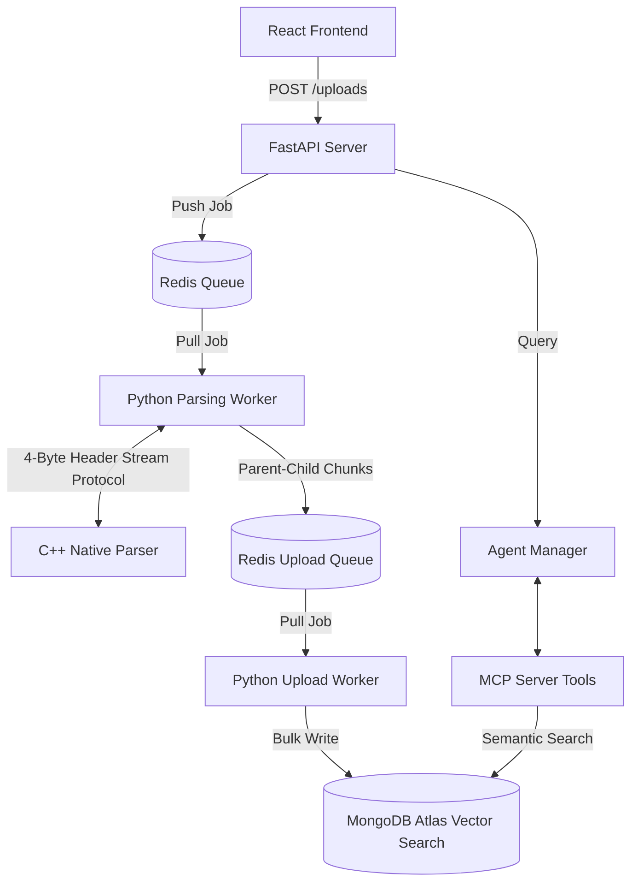

# Risk-Sent: High-Performance Financial Document Intelligence


**Risk-Sent** is a high-performance AI-powered financial document intelligence platform designed to automate the extraction, analysis, and querying of complex regulatory filings (e.g., 10-K, 10-Q, annual reports). By combining native C++ performance with modern Retrieval-Augmented Generation (RAG) architectures, Risk-Sent eliminates the traditional bottlenecks of large-scale document processing.

---

## 🚀 Overview

Financial analysts spend countless hours navigating massive filings to locate risk signals, disclosures, and narrative insights. Risk-Sent transforms this workflow by:

* ⚡ Parsing documents using a multi-threaded C++ engine
* 🧠 Structuring knowledge through Parent–Child RAG
* 🔎 Enabling semantic search over financial narratives
* 🤖 Providing agentic querying via MCP tools
* 📈 Maintaining long-running contextual conversations

The system is designed for **throughput, scalability, and low-latency querying** under heavy workloads.

---

## 🏗️ System Architecture

Risk-Sent uses a distributed, multi-process architecture where CPU-intensive workloads are isolated from the API layer to maintain responsiveness.



### ⚡ High-Performance C++ Bridge

To bypass Python's GIL and maximize throughput, Risk-Sent offloads PDF parsing to a multi-threaded C++ binary.

* **Stream Protocol:** Python and C++ communicate using a custom 4-byte header protocol that encodes payload size, ensuring reliable high-speed streaming.
* **Efficiency:** Full CPU utilization during parsing while the FastAPI event loop remains non-blocking.

---

## ✨ Core Features

### 1️⃣ Advanced Parent–Child RAG

Unlike traditional RAG pipelines:

* **Child Chunks:** Small semantic units optimized for embedding accuracy.
* **Parent Chunks:** Larger contextual segments retrieved after a match to preserve narrative coherence.

This architecture improves reasoning over long financial disclosures.

### 2️⃣ MCP (Model Context Protocol) Server

Risk-Sent invokes an MCP server as a child process, allowing the LLM to dynamically call tools such as `semantic_search` against MongoDB Atlas Vector Search. This enables true agentic behavior.

### 3️⃣ Intelligent Conversation Memory

A custom memory manager maintains:

* **Short-term memory:** Recent conversation context
* **Long-term memory:** Persistent research history

This allows analysts to conduct extended investigative sessions without context loss.

### 4️⃣ Scalable Redis Workers

* **Parsing Worker:** Consumes from `parse_queue`, manages C++ lifecycle, and generates document chunks.
* **Upload Worker:** Consumes from `upload_queue` and performs bulk MongoDB writes to minimize round trips.

---

## 🛠️ Tech Stack

| Layer           | Technology                    |
| --------------- | ----------------------------- |
| Backend API     | FastAPI, Python               |
| Native Engine   | C++                           |
| Vector Database | MongoDB Atlas (Vector Search) |
| Queue System    | Redis                         |
| AI Framework    | LangChain, MCP                |
| LLM Providers   | GROQ                          |
| Frontend        | React + Vite                  |
| Deployment      | Docker                        |

---

## 📁 Project Structure

```
.
├── app/
│   ├── api/                    # API Versioning and Routing
│   │   └── v1/
│   │       ├── routes/         # Endpoint definitions (chats, uploads, users)
│   │       └── router.py       # Main V1 Router aggregator
│   ├── core/                   # Application-wide singletons and logic
│   │   ├── agent_manager.py    # Orchestration of MCP + LLM
│   │   ├── auth.py             # JWT/Security logic
│   │   ├── config.py           # Pydantic Settings / ENV loading
│   │   └── logging.py          # Unified logging configuration
│   ├── db/                     # Data persistence layer
│   │   └── client.py           # MongoDB / Vector Search clients
│   ├── models/                 
│   ├── schemas/                # Pydantic request/response models
│   ├── services/               # Pure business logic
│   │   ├── ai_service.py       # RAG Service
│   │   ├── chat_services.py    # Chat-specific operations
│   │   ├── redis.py            # Redis Queue management
│   │   └── user_service.py     # User management logic
│   ├── utils/                  # Reusable helper functions
│   └── workers/                # High-performance Task Processing
│       ├── worker.cpp          # Native C++ Parser source
│       ├── parsing_worker.py   # Python bridge for C++ subprocess
│       └── upload_worker.py    # Async background DB ingestion
│   └── main.py                 # FastAPI Application entry point
├── mcp-server/                 # Model Context Protocol Implementation
│   ├── tools/                  # LLM-accessible tool definitions
│   └── server.py               # MCP Server entry point
├── data/                       # Sample data & uploaded PDFs
├── tests/                      # Integration and Load testing
│   └── load_test.py
├── Dockerfile                  # Multi-process build configuration
└── requirements.txt            # Python dependencies
```

---

## ⚙️ Setup & Deployment

### 1️⃣ Build the Image

The Dockerfile compiles the C++ parser and prepares the Python 3.12 runtime automatically.

```bash
docker build -t risk-sent-app .
```

### 2️⃣ Configure Environment

Create a `.env` file:

```env
MONGO_URI=your_mongodb_uri
GROQ_API_KEY=your_api_key
```

### 3️⃣ Run the System

```bash
docker run -d \
  -p 8000:8000 \
  --name risk-sent-container \
  --restart unless-stopped \
  risk-sent-app
```

---

## 📡 Accessing the API

Once running, access the backend:

👉 [http://localhost:8000](http://localhost:8000)

---

## 🎯 Target Audience

Risk-Sent is built for:

* Financial Analysts
* Risk Managers
* Research Analysts
* Compliance Teams

who need to extract actionable insights from thousands of pages of financial disclosures with minimal manual effort.


